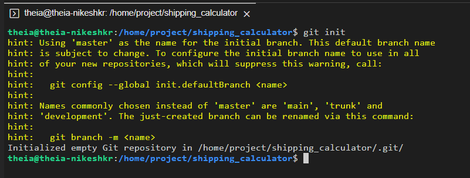
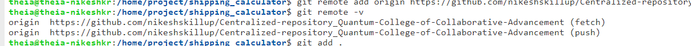
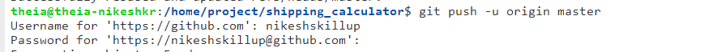

### Part 1


## Lab Tasks

1. **Fork the Centralized GitHub Repository:**
   Fork this empty GitHub repository for your academic project: https://github.com/Sklup55/Centralized-repository_for_collaboration"

2. **Set up the project folders and Initial it with a Contribution Guidelines file**

In lab env <br>
- Create project folder named `shipping_calculator`.
- Inisde this, create another folder having project name, your name, department, section, roll no. 

Suppose your details are:

Name: John Doe <br>
Deparatment: CS (Computer Science) <br>
Section: S01<br>
Roll no: 5

Your project folder's name should be: `shipping_calculator-John_Doe-CS-S01-5`. 
> Note: Ensure adhering to this nomencalture

Inside this project folder, create file named `contribution_guidelines.txt` which defines how the student can contribute to your project.

> Copy the below text and paste it in your file.

```
Student Contribution Guidelines

Open Collaboration:
As a student contributor, I commit to active and open collaboration, valuing diverse contributions within our college community.

Clear Documentation:
I'll provide clear code documentation in my projects.

Compliance:
I will always ensure compliance with our college rules and regulations.
```

<br>

<FOLLOW SAME PROCESS AS EXERCISE 1 OF PRACTICE PROJECT WE CREATED BEFORE THIS>
<br>


3. **Add a Remote Origin:**

Open a new terminal and navigate to the `/shipping_calculator` folder:

```
cd shipping_calculator
```

Configure your Git user information:


```
git config --global user.email "your-email@example.com"
```

```
git config --global user.name "YourName"
```


Run the following command to initialize a new Git repository:

```
git init
```
You may get an output:

- Either, like this:

 <br> <br>

- Or, like this:
 <br> <br>

> Both mention that an empty Git repository has been initialized in the working directory.

To add your newly created GitHub repository as a remote repository, run the below command by replacing "Github username" with your actual Github username

```
git remote add origin https://github.com/<Github username>/Centralized-repository_for_collaboration.git
```
> **NOTE:** Do not use the angular brackets < > when replacing your GitHub username in the above command.

 <br> <br>


<br>


<br>

4. **Commit and Push to GitHub:**
   - Commit the code changes you've made and push them to your GitHub repository.

```
git add .
```

```
git commit -m "Added first.txt"
```

Check the remote origins by running:

```
git remote -v
```

 <br> <br>

- `Fetch URL`: This is the URL that Git will use when fetching changes from the remote repository named "origin."

- `Push URL`: This is the URL used when pushing changes to the remote repository.

- So here, it fetches changes from the GitHub repository `https://github.com/"Github username"/Centralized-repository_for_collaboration.git` and pushes the changes to the same repository.

To rebase your local changes on top of the remote changes:

```
git pull --rebase origin maste
```
 <br> <br>

- `Git Pull with Rebase`: The command `git pull --rebase origin master` fetches and updates changes.
- `Clean Commit History`: It reorganizes your local commits for a clean, linear history.
- `No Merge Commits`: This method avoids creating merge commits.


If the default branch in your repository is `main`, the command will be:

```
git push -u origin main
```

If it is `master`, the command will be:

```
git push -u origin master
```
<br>

> **NOTE:** In the past the default branch in your GitHub repo used the name master. Effective Oct 1. 2020, all new GitHub repositories use the more inclusive term main as the name of the default branch instead of master.

#### Scenario 1: You may either have to follow the below process:

- You will get the below pop-up in the Theia enviornment. Click on `Allow`.

 <br> <br>

>> NOTE: Please **ignore** this message as it is **not related to the git commands and does not affect the process**.

>>  <br> <br>

- You will get a prompt at the top.  Type your Github username and press `Enter`.

 <br>


- You will get another prompt at the top. Type your Github PAT (Personal access token) and press `Enter`.

 <br> <br>


#### Scenario 2: Or have to follow the below process:

- You will get a prompt in the terminal.  Type your Github username and press `Enter`.

 <br> <br>

- You will get another prompt in the terminal. Type your Github PAT (Personal access token) and press `Enter`.

 <br> <br>

#### You may get either of these scenarios based on the Theia environment . Please follow the process accordingly.


#### With this, your changes will be pushed successfully to the remote origin repository.

- If the default branch in your repository is `main`:

 <br> <br>

- Else, if it is `master`:

 <br> <br>


You should be able to see the changes you pushed in, the remote repository:

 <br> <br>


