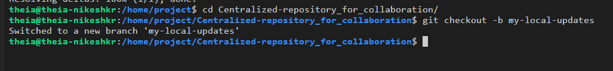
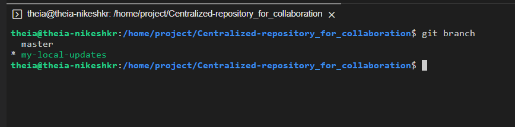
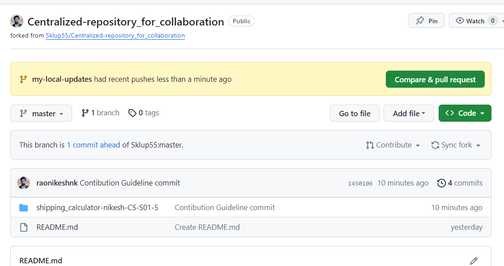
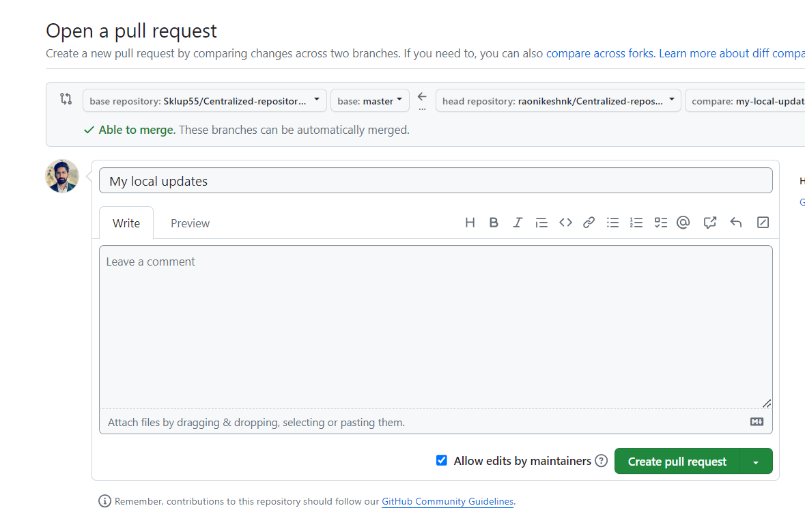

### Part 1


## Lab Tasks

1. **Clone the Centralized GitHub Repository:**
   Fork this empty GitHub repository for your academic project: 
   ```
   https://github.com/<YourUsername>/Centralized-repository_for_collaboration"
   ```

2. **Create HTML File:**
   Inside the `Shipping_Calculator-John_Doe-CS-S01-5` project folder, create a HTML file named `Shipping_Calculator.html` and add basic HTML template.


3. **Create a new branch in your repo named `my-project`.**

Open terminal and navigate to the "Centralized-repository_for_collaboration" folder. 
```
cd Centralized-repository_for_collaboration/
```

HINT: Use the `git checkout` command.
```
git checkout -b my-project
```
 <br> <br>

> NOTE:  The `-b` flag  is used to create a new branch and switch to it. If the branch is already present, we can swtich to it without using the flag (For example: `git checkout my-project`).


3. Verify that you are on the new branch by running the `git branch` command.

 <br> <br>

4. Add and commit your changes with a different commit message.

```
git add .
```

- Please use a different commit message this time

```
git commit -m "further updates made for pushing to branch-02"
```


5. Push the changes to `my-project`

```
git push --set-upstream origin my-project
```
 <br>

**In this command:**

- `--set-upstream` : This option sets up a tracking relationship between the local branch [`my-project`] , and the remote branch [`main` or `master`] on the remote repository. In future, when you run git push or git pull, Git will know to push or pull changes to or from `my-project`.

- `origin`: This is the name of the remote repository.

- `my-project`: This is the new branch to which you are pushing the changes.

<br>

#### In your Github repository:

6. You would have received a Pull Request notification in your GitHub Repo (UI) - Click on the `Compare and pull request` notification.

 <br> <br>

7. Add a comment (this is optional) & Click on `Create pull request`.

 <br>

- Since `my-project	`and the master branch  belong to your Github account, you see the `base` and `compare` fields like this.

<details>

<br>

<summary> <b> Click here to see the process when you are pushing from a branch on your Github account to a branch on another Github account. </b> </summary>

-  Click on `compare across forks`

 <br>

- You will get a page similar to this:

 <br>

The `head repository` and the `compare` fields pertain to the repository URL and branch respectively on your Github account.

The `base repository` and the `base` fields pertain to the repository URL and branch respectively of the Github account where you wish to raise a pull request.

- Select the corresponding fields from the dropdown to create the pull request.

</details>

8. Click on merge pull request

 <br>

9. Click on `Confirm merge`.

 <br>

10. The request once merged successfully can be seen as shown in the below screenshot:

 <br>

11. You can delete `my-project` by clicking on `Delete branch`, since it is no longer required.

 <br>

